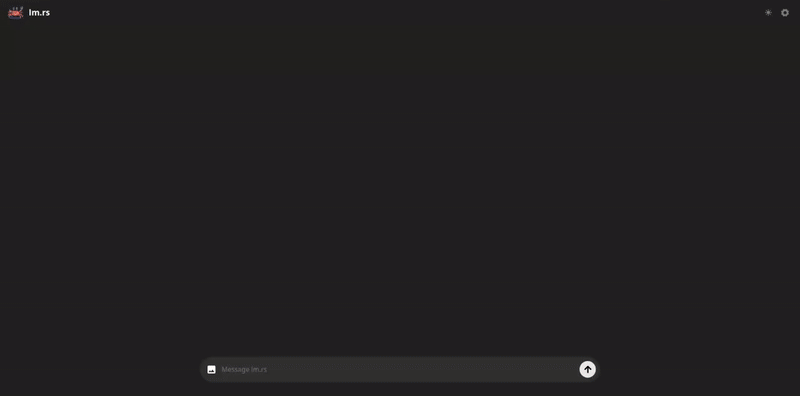

# Frontend WebUI for lm.rs



Simple frontend WebUI for the [lm.rs](https://github.com/samuel-vitorino/lm.rs) project, with markdown support and syntax highlighting. Talk to Language Models on the browser, on-device!

You can send images when using models that support this feature (currently only PHI-3.5 Vision). While it's possible to send multiple images in separate prompts, it's recommended to include only one image in your initial prompt.

Make sure you compiled and are running the [lm.rs](https://github.com/samuel-vitorino/lm.rs) backend binary first.

If you don't want to build the frontend locally go to the published [github page](https://samuel-vitorino.github.io/lm.rs-webui/) and connect to your lm.rs backend (defaults to localhost).

You can have the backend running on a remote server, change the endpoint on the settings menu.

Some TODOs:

- [ ] Chats management
- [ ] Give custom instructions
- [X] Add dark theme

## Instructions

For development just run:

```properties
npm run dev
```

To build run:

```properties
npm run build
```